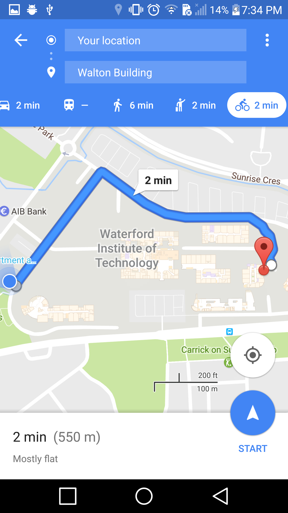

# LocationApp
###### Location Application for Agile Software Development
***


This mobile applications intention is to bring a new experience to users in a new social network. This social network is all about
connecting with others in the real world through technology. It allows users to see what events and activities are going on in their
local area and add their own activities as well. 

Users have access to a map through <b>Google Map API</b> and can see on a map what activities are currently going on.
Users will have access through a <b>SQLite database</b> to see a history of their activities that they have created.

Through the use of the GoogleSignOn API users will be able to sign on with their Google accounts and sync their data.
***

##App Theme:


<li>https://gist.github.com/PurpleBooth/109311bb0361f32d87a2</li>
<li>https://github.com/adam-p/markdown-here/wiki/Markdown-Cheatsheet</li>
<li><strong>Primary Color</strong>#8F1BB8</li>
<li><strong>Secondary Color</strong>#B563D2</li>
<li><strong>Tertiary Color</strong>#9F3CC2</li>
<li><strong>Accent Color</strong>#F5FD1C</li>


***


## About App:


The purpose of this app is to ~~be awesome!~~ find users *current* locations and add them to a list in a **SQLite** database. Users will sign on through the use of the [**GoogleSignOn API**](https://developers.google.com/identity/sign-in/android/)
***
```Java
// Configure sign-in to request the user's ID, email address, and basic profile. ID and
// basic profile are included in DEFAULT_SIGN_IN.
GoogleSignInOptions gso = new GoogleSignInOptions.Builder(GoogleSignInOptions.DEFAULT_SIGN_IN)
    .requestEmail()
    .build();

// Build a GoogleApiClient with access to GoogleSignIn.API and the options above.
mGoogleApiClient = new GoogleApiClient.Builder(this)
    .enableAutoManage(this, this)
    .addApi(Auth.GOOGLE_SIGN_IN_API, gso)
    .build();
```
***

Markdown | Less | Pretty
--- | --- | ---
*Still* | `renders` | **nicely**
1 | 2 | 3
***
> Blockquotes are very handy in email to emulate reply text.
> This line is part of the same quote.


Notes
=====

Since the demonstration, the following changes and notes should be read
over.

-   A RecycleView with CardView’s that are dynamically populated have
    been added, but are not visible in the APK.

-   Styling to the View Locations (detailed) has been done, also
    allowing users to click the posters email. This will launch an email
    intent with the posters email in the send to box.

-   Privacy levels from the database are in effect, so when a user adds
    a private event, only that user can see it in the “My Locations”
    page.

-   A share button has been added in the side navigation panel. This way
    if users like my application they can share it with their friends.

Build Note
==========

The current build version of this application is Alpha 0.1. It is
available for alpha testing on the google play store to only 6 alpha
testers. There are many future functionality and design plans for this
application before it will be at its final release stages. Please refer
to the future implementations section of this document for greater
detail in these areas.

Introduction
============

Check In is a location aware tracking and reporting android application
with a strong push towards social interactions. This app is meant for
anyone from 12-90 who wants to stay connected in the immediate area
around them. It aims to provide the most recent updates with what is
going on locally, keeping track of user’s locations, activities, times,
and user information. It accomplishes this using lists and map views
giving detail about the event. Users can connect through this app to
meetup in real life and hang out. Users sign in through their Google
accounts and add a new “Check-In” as well as view all other public
“Check-Ins” in their area.

Prerequisites
=============

The application APK file is also 52mb large, so at least 60mb are
required during installation so that the database will have some
functionality.

This application is targeted towards Android Marshmallow 6.0 (SDK 23)
and supports up to a minimum of Android KitKat 4.4.4 (SDK 19). This
means that the application supports up to 73.9% of active devices on the
Google Play store. It supports 7188 devices and 7061 devices are
unsupported per the developer console.

Screens and Processes
=====================


Splash and Login 
-------------------------------------------------------------------------------------------------------------------------------------------------------------------------------------


The initial screenshot is of the splash screen. This is trying to depict
the image of adding a location to the user’s current location, which is
the primary function of the app. After 3 seconds, the Login Activity is
started.

The Login activity prompts users to sign in through their google
account. In the background, there is a video view that will choose
through 7 random different video time lapses of Dublin, Ireland. There
is a sign in button with the google logo, and a “Disconnect from Google”
text view at the bottom of this layout. If the users sign in is cached,
they will be automatically signed in.

If the user is not signed in or they have been logged out, the user can
click the login button with the google logo and be prompted to choose a
google account to sign in with. If the users google account is not
listed, they can add it to the list by clicking the “Add account” text
at the bottom of the prompt. This will guide the user through adding
their google account to the application.

 Navigation
-----------

{width="2.5833333333333335in"
height="4.615017497812773in"}

Location Feed
-------------


{width="1.9084765966754156in"
height="3.3958333333333335in"}

The location feed shows the signed in user a list of activities going on
in the local area ordered by most recently added. It displays each
“Event” or “Check-In” in a custom row in a list view. Each row in the
list will show the user who added it, their profile picture (using a
circle image view implementing a GitHub library), the activity name, how
long ago the event was posted (using a library from GitHub to convert a
date time into “timeAgo”), and the distance to the event. Users can
scroll through this list as well as tap on one of the events they may be
interested in to gain further detail. Please see the next section for a
further explanation of this view.

 View Location (detailed)
-------------------------


Users will see a map containing a pin in the location that they pressed
from the location feed. Users are presented with further information
regarding the event in a clean UI and are also able to click the pin on
the map to be prompted for directions which will open a google maps
activity and populate directions to the event. Users can also click the
email of the event poster/owner at the bottom of the screen and an email
activity will be launched, passing the email to the send box. This
allows users to email the poster about the event. At any time users can
click the FAB to be brought to the Add Location screen.

### Email & Directions


{width="2.59375in"
height="4.6227318460192475in"}

Add Location
------------

  

Users current location will be calculated when this screen is open and
the app will reverse geocode the Latitude and Longitude into a physical
address. The app will also display the current systems time. Users are
presented with an Edit Text element that they must populate before
saving (the hint is picnic…). Users **must** have a relatively strong
connection for the app to find their location or else it will time out
and not find a location. If a user’s location isn’t found in time and
the application gives up trying to find it, when the user saves a
snack-bar will pop up and provide a link to ensure the app has location
services enabled.

Map View
--------

 

On this screen users have a full screen map which they can navigate
through all the public event location pins. Each pin contains more
information in an info window when the user taps it. Users can zoom in
and out, find their current location, and get directions to any pin on
the map.

My Locations
------------


This screen shows a list view of all locations (private, public, or
friends) that the currently logged in user has added. It also orders
them by most recently added. Users can click these items and enter a
non-functional edit screen. Please refer to the future developments
section, regarding the future developments in this fragment.

Share
-----


Users can click the share option in the navigation drawer to share this
application with their friends. An action send intent is then called
which shows this screen. When users choose an option, they will be
redirected to that application where a pre-populated message will be
shown. Please refer to the next section for further detail.

###  Email


 Info
-----


Future Developments
===================

There are many different future implementations that are possible and
viable for this application. A short list of developments that are
already underway or complete but not suitable for this build version are
as follows:

-   RecycleView with CardView, populated by the database

-   Material Design Animations in the recycle view

-   Settings screen

-   Edit My Locations fragment for updating currently logged in user’s
    locations

Some future developments that are not started but have yet to be
implemented towards the final build of the app are not limited to but
involve the following:

-   Remote database to support multiple users

-   User messaging

-   Geofences (enter, exit events)

-   User Notifications

-   Further security and optimizations

-   RecycleView – CardView swipe to delete/edit

-   Delete My Locations / Edit My Locations

-   Check-in to events / leave events

-   Rating Events

-   Sorting in Location feed (sort by time ago, distance, person, event
    type)

-   Searching

UML Diagrams
============

This is an activity diagram that represents a high-level activity flow
for a user in the applications life cycle.

References
==========

Much of the code in this application was written from scratch and was
built with reference towards the following sources:

-   <http://stackoverflow.com/>

-   <https://github.com/>

-   <https://ddrohan.github.io/mad-2016/index.html>

-   <https://www.youtube.com/>

-   <https://developers.google.com/>

-   <https://developer.android.com/training/location/index.html>

-   <https://developer.android.com/training/location/retrieve-current.html>

-   <https://developers.google.com/maps/documentation/android-api/start>

-   <https://developers.google.com/identity/sign-in/android/start-integrating>

The following libraries from GitHub were used

-   <https://github.com/vinc3m1/RoundedImageView>

-   <https://github.com/daimajia/AndroidViewAnimations>

-   <https://github.com/marlonlom/timeago>

I used a class from

*//http://stackoverflow.com/questions/11790104/how-to-storebitmap-image-and-retrieve-image-from-sqlite-database-in-android*

To create a class called DbBitmapUtility that would offer public methods
to convert between a byte array and a bitmap object. This was to ease
with the transitioning between a blow and byte array for saving an image
in the database.

*//https://github.com/googlesamples/google-services/tree/master/android/signin*

Or the sign in class from the google samples GitHub page for
implementing a sign in with google for my app.

Multiple tutorials were followed, not strictly, but to see how the
implemented certain functions differently that may benefit this
application. These tutorials are as follows.

*//http://www.androidhive.info/2015/05/android-swipe-down-to-refresh-listview-tutorial/*

This was used to implement a swipe to refresh view with my list view on
the home page / location feed

*//http://mobilesiri.com/android-sqlite-database-tutorial-using-android-studio/*

This was used to implement the SQLite database into the android
application as I had no experience before this on using a database
within the context of an android application.

*//http://stackoverflow.com/questions/12953547/android-opening-an-email-application-on-clicking-the-label*

This was used to see how to redirect a user to an email intent from a
label link in an android app, specifically on the View Locations
(Detailed) screen.

*//http://stackoverflow.com/questions/5482402/android-load-values-from-sqlite-database-to-an-arraylist*

This was used to observe how to load values from a SQLite database into
an array list, I used similar resources for creating a customer cursor
adapter and a populating it from the SQLite database.

*//http://stackoverflow.com/questions/4969217/share-application-link-in-android*

This was used to implement the share intent that opens a dialogue with
multiple share options to share the android application.


